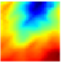

# 超解像練習

## 概要
|低解像度||高解像度|
|-|-|-|
||⇒||

超解像技術とは画像を高解像度化する技術です。  
ある気象データを使って超解像タスクに挑戦してみました。  

## train_test.ipynb
モデルの学習とテスト
- MLP
- CNN①(SRCNN)
- CNN②(U-Net)
- CNN③(SE-SRResNet)

## metrics_visualization.ipynb
予測結果の評価と可視化

metrics

- PSNR(ピーク信号対雑音比)
- RMSE(二乗平均平方根誤差)
- ME(平均誤差)
- CORR(ピアソンの積率相関係数)

graphs・images

- サンプルgif
- ヒストグラム
- 時系列グラフ
- 日変動グラフ
- 領域マップ
- 散布図(yyplot)

